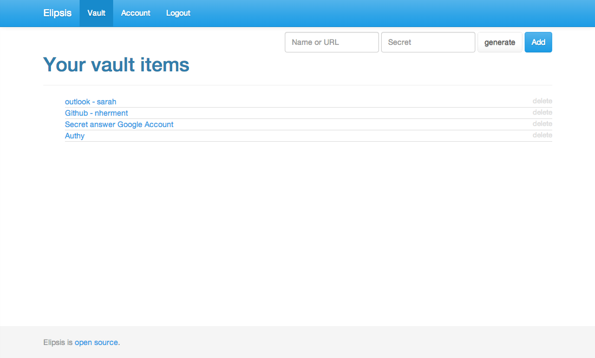
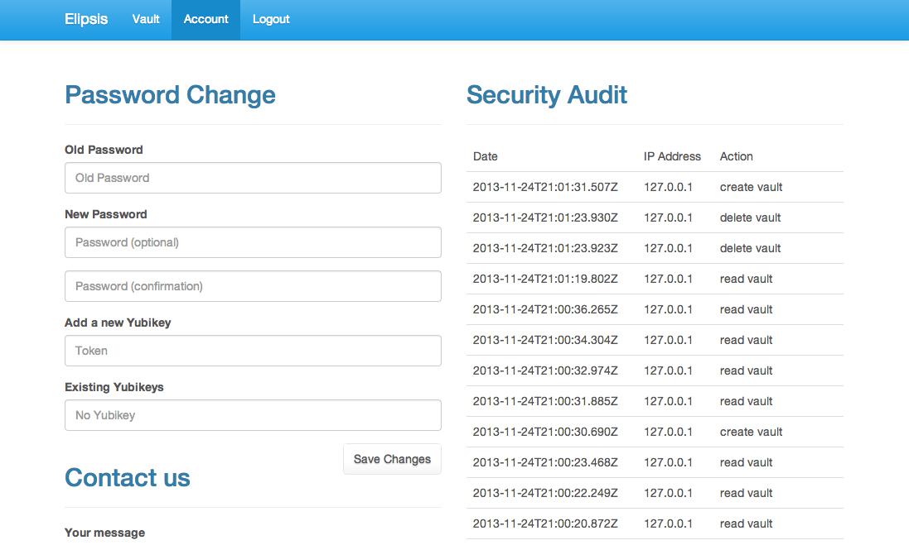

About
=====

Elipsis is an online  password management tool.

How does it works ?
===================

Elipsis encrypts all your other passwords based on a single one. This is better security as because you can:

- make this one password very secure so that nobody can ever find out what it is
- use more secure passwords for all the websites you use because you don't have to remember them
- change this very secure password more often



* Elipsis Also gives you a full security audit of the latest activity on your account.




Install
=======

```
  [Install node.js](http://nodejs.org/download/)
  git clone https://github.com/nherment/elipsis.git
  cd elipsis
  make install
  make start
```

Security
========

Storage
-------

Passwords are hashed using a salted 512bits [PBKDF2](http://en.wikipedia.org/wiki/PBKDF2) hash. with 20*000 iterations.

Your secrets are encrypted based on another hash calculated similarly. The encryption mechanism uses
[AES-256](http://crypto.stackexchange.com/questions/2251/how-secure-is-aes-256).

Session
-------

When you sign in, the decryption key is moved to a temporary memory with a renewable lifetime of 20 seconds. This key is
discarded about 20 seconds after you leave the website (this time may take a bit longer depending on the load of the
server). The key is discarded immediately if you manually logout of the website.

The original password is discarded immediately after you login.

Audit logs (IP address, account emails) are not encrypted yet. The plan is to encrypt them so that only the user has
access to them. For the website security however, we will always keep a hash for these. It allows us to mitigate SPAM
and bruteforce attempts against the service.